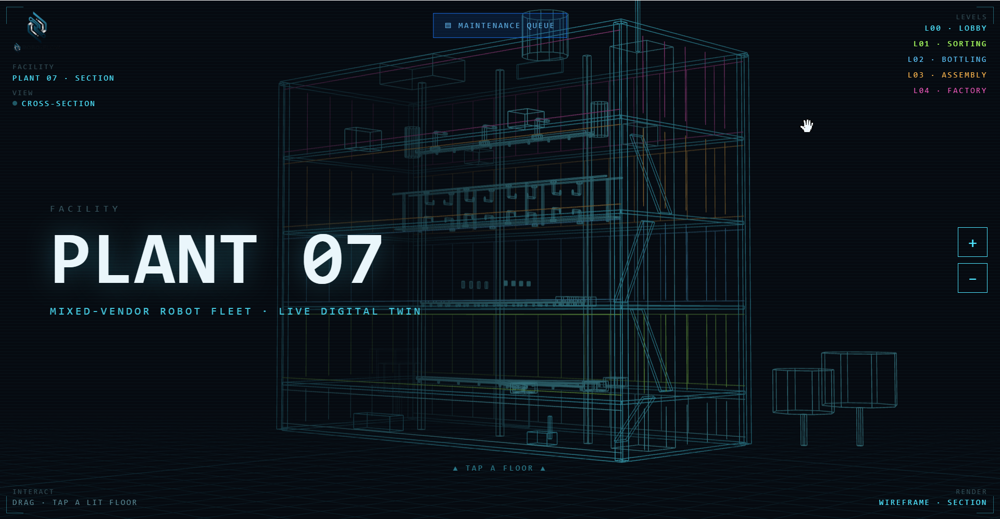

# RoboTbd

**One dashboard for your entire mixed-vendor robot fleet.**

AI-powered health monitoring, smart alarms, and failure predictions for industrial robots — any vendor, one screen.


**[Live Demo](https://roboflow-umber.vercel.app/?ws=wss://web-production-27a5.up.railway.app/ws)** · **[API Health](https://web-production-27a5.up.railway.app/api/health)**



## The Problem

73% of factories run robots from 2+ vendors (IFR 2025). Each vendor ships their own monitoring tool — UR Insight, KUKA Connect, ABB Ability, FANUC ZDT. Maintenance managers juggle 3-4 dashboards, 3-4 alarm systems, and can't compare robots across brands. Unplanned downtime costs **$10-50K/hour**. Nobody has built the vendor-neutral robot monitoring layer.

## What We Built

```
Factory Floor                   RoboTbd                        Dashboard
─────────────                   ───────                        ─────────

 ┌──────┐
 │ UR10 │──┐
 └──────┘  │
 ┌──────┐  │   OPC-UA      ┌──────────────┐   WebSocket    ┌──────────┐
 │ KUKA │──┼────────────>   │  Normalize   │ ──────────────>│ Health:95│
 └──────┘  │                │  Score       │                │ Alarms:2 │
 ┌──────┐  │                │  Diagnose    │                │ AI: Bear-│
 │ ABB  │──┘                │  Predict     │                │ ing wear │
 └──────┘                   └──────────────┘                └──────────┘
```

### Features

- **Multi-vendor normalization** — UR, KUKA, ABB sensor data normalized to one common schema via device profiles
- **Health scoring** — Per-joint and per-robot scores (0-100). Formula: `min(joints) × 0.4 + avg(joints) × 0.6`. One bad joint drags the whole robot down
- **Smart alarms** — Threshold detection with 30s deduplication and auto-resolve. No alarm spam
- **Failure prediction** — Linear regression on rolling 60-point windows. "18 days to failure at 87% confidence"
- **AI diagnostics (Qwen)** — When alarms fire, Qwen analyzes all sensor context against real vendor specs and known failure patterns. Returns root cause, evidence, action plan, and part numbers
- **Real robot data** — Uses actual UR5 and SO-ARM100 recordings from HuggingFace, not synthetic data
- **3D factory visualization** — Interactive Three.js factory floor with real-time robot status

### AI Diagnostics — The Differentiator

Not just "temperature is high." Our AI reasons about **WHY**:

```
ALARM: Robot2 Joint 3 temperature 72°C

AI DIAGNOSIS (Qwen, 2 seconds):
  Bearing degradation — 4/4 sensors confirm

  Evidence:
  ✓ Temperature rising (exceeds KUKA >70°C spec)
  ✓ Vibration elevated (high-frequency bearing signature)
  ✓ Current rising (motor compensating for friction)
  ✓ Torque stable (rules out external load change)

  Action: Replace bearing within 14 days
  Parts: Nabtesco RV reducer (€2,000-8,000)
```

Diagnoses are grounded in real vendor documentation — UR Service Manual specs, KUKA RV reducer maintenance intervals, ABB integrated motor-gearbox thresholds. **Not hallucinated.**

## Architecture

```
robolink/
  sources/
    base.py              # Abstract DataSource + SensorReading dataclass
    opcua_source.py      # OPC-UA client (asyncua, push subscriptions)
  formatter.py           # Normalize vendor data to [-1,1] common range
  monitor.py             # Health scoring engine (per-joint, per-robot)
  alarms.py              # Threshold detection, 30s dedup, auto-resolve
  prediction.py          # Linear regression failure prediction
  diagnosis.py           # Qwen AI diagnostics with vendor knowledge base

sim_server.py            # OPC-UA simulation (3 robots, 108 nodes, 10Hz)
server.py                # FastAPI backend (REST + WebSocket)
start.py                 # Combined launcher for cloud deployment
dashboard/
  index.html             # 3D factory floor (Three.js) + data panels
  three.min.js           # Three.js bundled locally
```

## Quick Start

```bash
# Install dependencies
pip install -r requirements.txt

# Set Qwen API key (for AI diagnostics)
export DASHSCOPE_API_KEY="your-key-here"

# Option 1: Run everything at once
python start.py

# Option 2: Run separately
python sim_server.py            # Terminal 1: OPC-UA simulation
uvicorn server:app --port 8000  # Terminal 2: API server

# Open dashboard
open http://localhost:8000/dashboard
```

## API

| Endpoint | Method | Description |
|----------|--------|-------------|
| `/ws` | WebSocket | Real-time updates every 500ms |
| `/api/robots` | GET | All robot states with joint data |
| `/api/alarms` | GET | Active alarms |
| `/api/alarms/history` | GET | All alarms including resolved |
| `/api/predictions` | GET | Failure predictions |
| `/api/diagnosis` | GET | Latest AI diagnosis |
| `/api/diagnosis/history` | GET | All past diagnoses |
| `/api/health` | GET | Server health check |

## Real Robot Data

All demo data comes from public, verifiable HuggingFace datasets:

| Dataset | Source | Frames | What |
|---------|--------|--------|------|
| [UR5 Robotiq](https://huggingface.co/datasets/SleepyShaman123/reach_ur5_robotiq) | LeRobot | 274 | Real joint positions, torques, velocities |
| [Robothon Expert](https://huggingface.co/datasets/kantine/industrial_robothon_buttons_expert) | LeRobot | 896 | Normal robot operation baseline |
| [Robothon Anomaly](https://huggingface.co/datasets/kantine/industrial_robothon_buttons_anomaly) | LeRobot | 896 | Anomalous robot behavior patterns |

## Tech Stack

Python 3.12 · asyncua (OPC-UA) · FastAPI · uvicorn · structlog · numpy · OpenAI SDK (Qwen) · Three.js

**Deployment:** Railway (backend) · Vercel (frontend)

## Roadmap

- **Month 1:** Authentication, TimescaleDB persistence, mobile operator view
- **Month 2-3:** First pilot customer with real factory OPC-UA endpoint
- **Month 4-6:** KUKA/ABB/FANUC device profiles from real deployments, MQTT connector
- **Year 2:** Cross-fleet failure pattern library, premium AI diagnostics tier
- **Year 3:** Robot data API for Physical AI training pipelines (pi0, LeRobot, Cosmos)

## Business Model

$50/robot/month. 100 robots = $60K ARR. 3.5M industrial robots installed worldwide.

Monitoring is the wedge. The normalized cross-vendor robot data layer is the moat — training data for Physical AI that nobody else is collecting.

## Team

Built at [AI Beavers Founder Hackathon](https://www.aibeavers.com), Hamburg, June 6 2026.

- **Pratik Patil** — IoT Data & Connectivity Engineer at Danfoss. MS Mechatronics, Germany. Built industrial monitoring systems professionally.
- **Javi Mendoza** — 5 years in engineering security threat detection and incident response. 5 years in management consulting focused on finance and contract compliance.
- **Adam Alioua** — Digital Business Manager, Hamburg. Focus on digital business, innovation, and business development. [adam-alioua.me](https://adam-alioua.me/)

## License

MIT
